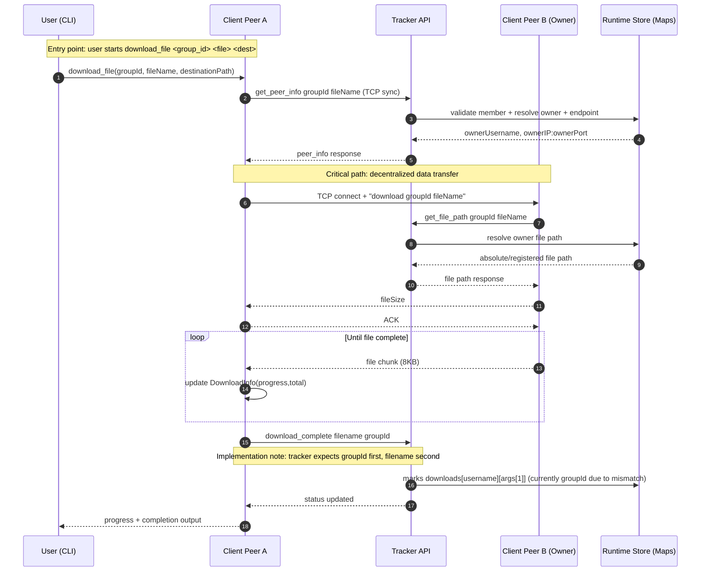
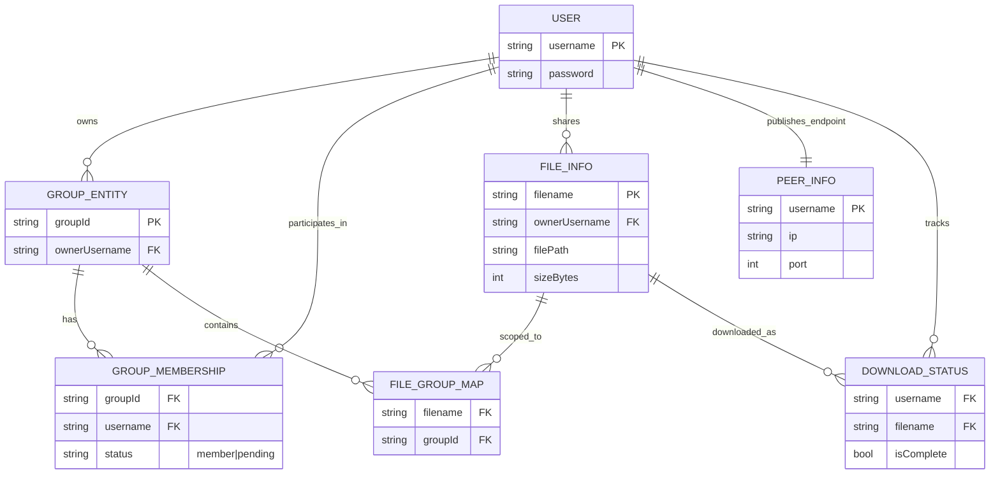
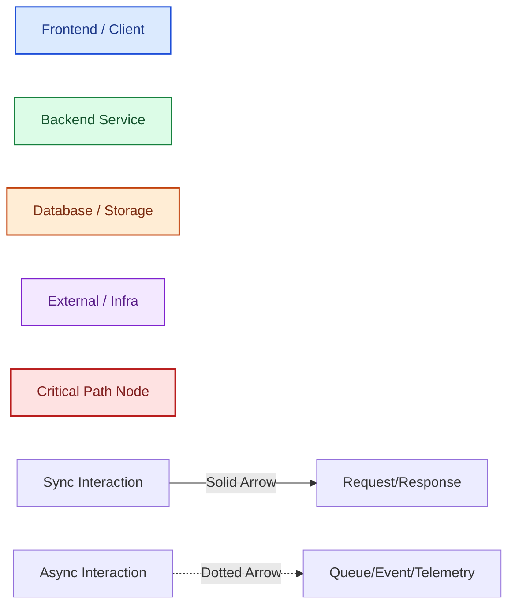
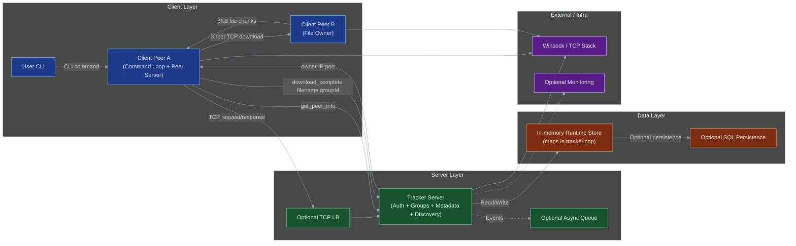
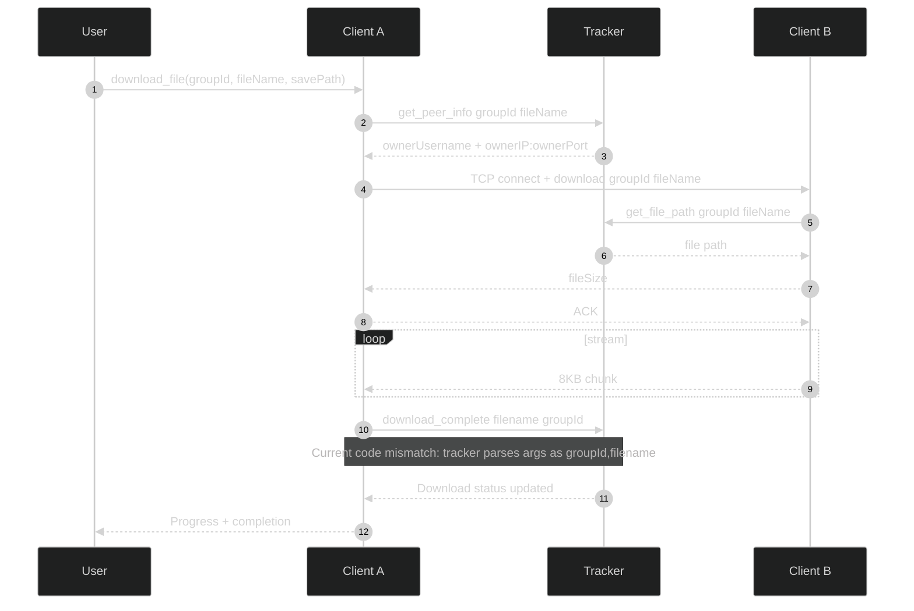
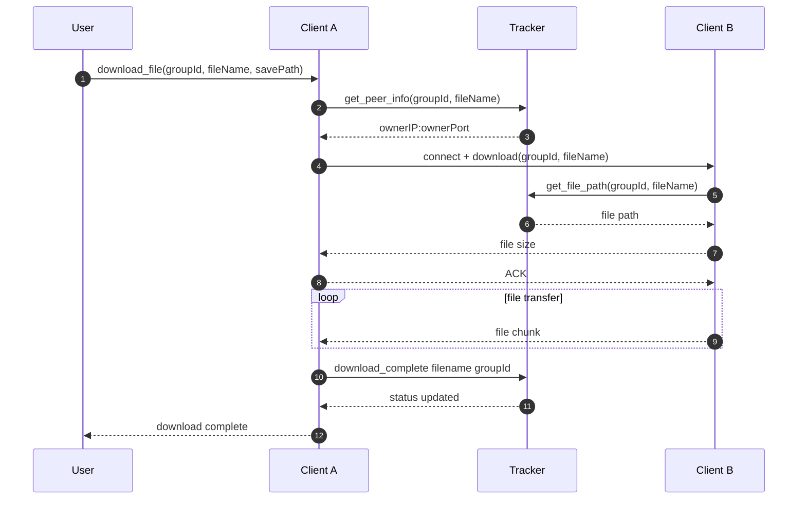
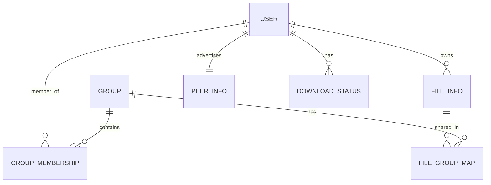

# System Architecture Diagram - Hybrid P2P File Sharing System (Verified)

This is the single consolidated architecture document for the project. It includes:
- Verified detailed diagrams
- Dark-theme presentation variants
- SVG-export-ready simplified variants

---

## Diagram Verification Status

- **Architecture flowchart:** Correct for current codebase (`client.cpp`, `tracker.cpp`).
- **Request lifecycle sequence:** Correct, with one highlighted implementation mismatch in `download_complete` argument order.
- **ER model:** Correct conceptual mapping of in-memory structures.
- **State diagram:** Removed to reduce clutter (not required for architecture understanding).

---

## 1) End-to-End Architecture (Flowchart)

```mermaid
flowchart LR
%% Hybrid P2P architecture: centralized control plane + decentralized data plane

%% =========================
%% Client Layer
%% =========================
subgraph CL["Client Layer (Entry + UX)"]
  U["User\nCLI Input / Commands"]
  C1["Client Peer A\n(UI Command Loop + Peer Server + Downloader)"]
  C2["Client Peer B\n(File Owner / Seeder)"]
end

%% =========================
%% Server Layer
%% =========================
subgraph SL["Server Layer (Coordination + Business Logic)"]
  LB["TCP Load Balancer (Optional)\nDistributes tracker traffic"]
  T1["Tracker API Instance #1\nAuth + Group Mgmt + File Metadata + Peer Discovery"]
  T2["Tracker API Instance #2 (Standby/Scale)\nFailover / Horizontal Scale"]
  AUTH["Auth Module\ncreate_user/login/logout"]
  GRP["Group Module\ncreate/join/accept/list"]
  META["Metadata Module\nupload/list/stop_share"]
  DISC["Discovery Module\nget_peer_info/get_file_path"]
  DL["Download Status Module\nshow_downloads/download_complete"]
  Q["Async Event Queue (Optional)\nAudit/analytics/events"]
  W["Background Worker (Optional)\nConsumes async events"]
end

%% =========================
%% Data Layer
%% =========================
subgraph DLAYER["Data Layer"]
  CACHE["In-Memory Cache / Hot State\npeerInfo, sessions, lookup maps"]
  MEMDB["Primary Runtime Store (Current)\nIn-process maps in tracker.cpp"]
  SQL["SQL DB (Optional Persistent Store)\nusers, groups, files, memberships, downloads"]
  NOSQL["NoSQL/Event Store (Optional)\ntelemetry, logs, activity stream"]
end

%% =========================
%% External Services
%% =========================
subgraph EX["External Services / Infrastructure"]
  NET["OS Networking Stack\nWinsock/TCP sockets"]
  OBS["Monitoring & Logging (Optional)\nmetrics, health, traces"]
  DNS["DNS / Service Discovery (Optional)\ntracker endpoint resolution"]
end

%% Entry and command path
U -->|CLI Command| C1
C1 -->|TCP Command (sync request)| LB
LB -->|Route Request| T1
LB -->|Failover Route| T2

%% Module decomposition inside tracker
T1 --> AUTH
T1 --> GRP
T1 --> META
T1 --> DISC
T1 --> DL

%% Data interactions
AUTH -->|Read/Write user credentials| MEMDB
GRP -->|Read/Write groups + membership| MEMDB
META -->|Read/Write file records| MEMDB
DISC -->|Resolve owner IP:port + file path| MEMDB
DL -->|Update download completion flags| MEMDB
T1 -->|Fast lookup| CACHE
CACHE -->|Cache miss/fill| MEMDB

%% Optional persistence and analytics
MEMDB -.->|Persist snapshots/events (async)| SQL
T1 -.->|Emit events (upload/download/login)| Q
Q -.->|Consume events| W
W -.->|Store analytics/logs| NOSQL

%% Peer discovery and direct data plane
C1 -->|get_peer_info(groupId,fileName)| T1
T1 -->|ownerUsername + ownerIP:ownerPort| C1
C1 -->|TCP direct connect + "download groupId fileName"| C2
C2 -->|File chunks (8KB stream)| C1

%% Output delivery
C1 -->|Progress + final status to user| U
C1 -->|download_complete filename groupId (current implementation)| T1

%% Infrastructure connections
T1 -->|Socket I/O| NET
C1 -->|Socket I/O| NET
C2 -->|Socket I/O| NET
LB -->|Health checks| T1
LB -->|Health checks| T2
T1 -.->|Metrics/logs| OBS
LB -.->|Endpoint resolution| DNS

%% Styling classes
classDef frontend fill:#dbeafe,stroke:#1d4ed8,color:#1e3a8a,stroke-width:1.5px;
classDef backend fill:#dcfce7,stroke:#15803d,color:#14532d,stroke-width:1.5px;
classDef database fill:#ffedd5,stroke:#c2410c,color:#7c2d12,stroke-width:1.5px;
classDef external fill:#f3e8ff,stroke:#7e22ce,color:#581c87,stroke-width:1.5px;
classDef critical fill:#fee2e2,stroke:#b91c1c,color:#7f1d1d,stroke-width:2px;

class U,C1,C2 frontend;
class LB,T1,T2,AUTH,GRP,META,DISC,DL,Q,W backend;
class CACHE,MEMDB,SQL,NOSQL database;
class NET,OBS,DNS external;
class C1,T1,C2 critical;

%% Interactive clickable nodes
click C1 "client.cpp" "Client app: command loop, peer server, downloader"
click T1 "tracker.cpp" "Tracker server: auth, groups, metadata, discovery"
click MEMDB "tracker.cpp" "In-memory maps used as runtime data store"
click U "README.md#available-commands" "CLI commands exposed to users"
click DISC "README.md#file-transfer-process" "Peer discovery and transfer process"
```

---

## 2) Request Lifecycle (Sequence Diagram)



---

## 3) Data Model (ER Diagram)



---

## 4) Legend and Conventions



---

## 5) Bottlenecks and Reliability Notes

- **Critical bottleneck:** single tracker process with in-memory state (no durable replication by default).
- **Current reliability profile:** tracker restart clears runtime state; peer data path remains decentralized.
- **Scale-out path shown in diagram:** load balancer + second tracker + optional SQL persistence + async queue.
- **Throughput behavior:** tracker handles lightweight metadata only, while bulk file transfer scales with number of peers.
- **Observed implementation inconsistency:** `client.cpp` sends `download_complete <filename> <groupId>`, while `tracker.cpp` parses as `<groupId> <filename>`.

---

## 6) Dark Theme Variants (Presentation)

### 6.1 Architecture Overview (Dark)



### 6.2 Download Lifecycle (Dark)



---

## 7) SVG Export Ready Variants (Simplified)

### 7.1 Core System Architecture (SVG)

```mermaid
flowchart LR
subgraph Client["Client Layer"]
  U["User (CLI)"]
  CA["Client Peer A"]
  CB["Client Peer B (Owner)"]
end

subgraph Server["Server Layer"]
  T["Tracker Server\nAuth + Groups + Metadata + Discovery"]
end

subgraph Data["Data Layer"]
  M["In-memory Store\nusers/groups/files/peerInfo/downloads"]
end

U -->|Input command| CA
CA -->|TCP metadata request| T
T -->|Metadata response| CA
T -->|Read/Write state| M
CA -->|Direct TCP download request| CB
CB -->|File stream (8KB chunks)| CA
CA -->|Progress + result| U
CA -->|download_complete filename groupId| T
```

### 7.2 Download Request-Response Cycle (SVG)



### 7.3 Data Relationships (SVG)



### 7.4 Export Tips

- Use Mermaid live editor or VS Code Mermaid preview to export SVG.
- Keep 16:9 canvas for architecture diagrams.
- Export diagrams individually for slide decks.

